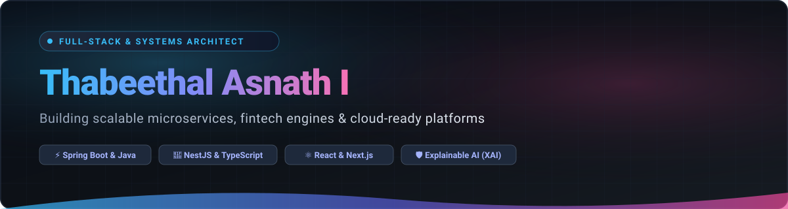

<div align="center">

  <!-- Header Banner -->
  

  <br /><br />

  <!-- Animated Typing Headline -->
  <a href="https://github.com/Thabeetha005">
    
  </a>

  <br /><br />

  <p align="center">
    <a href="https://www.linkedin.com/in/thabeethalasnath/" target="_blank"></a>
    <a href="mailto:thabeethalasnath@gmail.com"></a>
    <a href="https://github.com/Thabeetha005"></a>
  </p>

</div>

---

### 💫 About Me

```yaml
engineer:
  name: Thabeethal Asnath I
  role: Full-Stack & Backend Systems Engineer
  education: B.Tech in Information Technology — DMI College of Engineering (Anna University, 2022-2026)
  experience: Former Web Development Intern — Prodigy InfoTech (Received Outstanding Remarks)
  specialties: [Enterprise Full-Stack Platforms, Spring Boot Microservices, Multi-Portal Systems, Clean Architecture]
  philosophy: "Designing resilient systems where domain-driven backend logic meets intuitive user interfaces ⚡"
```

- 🎓 **Education**: Pursuing **B.Tech in Information Technology** at DMI College of Engineering (*Autonomous, Anna University: Chennai*).
- 💼 **Industry Experience**: Former **Web Development Intern at Prodigy InfoTech**, recognized with a Certificate of Completion with Outstanding Remarks for delivering modern web applications.
- 🏗️ **Architectural Focus**: Specializing in end-to-end software development — from crafting normalized relational schemas and secure RESTful microservices in **Java & Spring Boot** to responsive, reactive client portals in **React & Vite**.
- 🔐 **Security & Resiliency**: Practical experience implementing JWT stateless session management, role-based access control (RBAC), token rotation, and rate-limiting.

---

### 🔨 Currently Building

- 🌐 **Multi-Portal Commercial Platforms**: Designing and building decoupled, multi-tier architectures that coordinate customer browsing, merchant inventory management, and logistics fulfillment in real-time.
- ⚙️ **Enterprise Spring Boot Services**: Implementing validated state machines, dynamic JPA Criteria search specifications, and transaction-safe financial workflows.
- 📦 **Containerized Deployments**: Packaging multi-tier services with Docker and Docker Compose for reproducible production environments.

---

### 🛠️ Tech Stack

<div align="center">

#### 💻 Programming Languages
<p>
  
  
  
  
  
  
</p>

#### ⚙️ Backend & Architecture
<p>
  
  
  
  
  
  
  
  
</p>

#### 🎨 Frontend & UI
<p>
  
  
  
  
</p>

#### 🗄️ Databases & Persistence
<p>
  
  
  
  
  
</p>

#### 🚀 DevOps, Cloud & Tools
<p>
  
  
  
  
  
  
</p>

</div>

---

### ⭐ FEATURED PROJECTS

---

#### 💰 1. Finance Management System (Kalpanaaa Finance)
> **End-to-End Digital Wealth, Loan Automation & Financial Advisory Platform**

A comprehensive, production-oriented full-stack financial management platform designed to automate wealth tracking, investment planning, and personal/corporate credit workflows.

```
┌────────────────────────────────────────────────────────────────────────────────────────┐
│  💰 KALPANAAA FINANCE — END-TO-END PLATFORM ARCHITECTURE                               │
│                                                                                        │
│  [ Public Portal ]       [ Customer Dashboard ]     [ Consultant / Admin Portals ]     │
│  • Wealth advisory       • Digital wallet balance   • Client portfolio reviews         │
│  • Interactive ROI/EMI   • Instant withdrawals      • Executive deposit metrics        │
│  • Market insights blog  • Loan & EMI schedule      • System liquidity tracking        │
│          │                         │                              │                    │
│          └─────────────────────────┼──────────────────────────────┘                    │
│                                    ▼                                                   │
│                    [ React 18 + Vite + Tailwind CSS ]                                  │
│                                    │ (REST API / Axios)                                │
│                                    ▼                                                   │
│             [ Java 21 + Spring Boot 3.2 Backend Service ]                              │
│             • Role-Based Access Control (RBAC) & Secure Sessions                       │
│             • Financial Transaction Engine & Loan Amortization Logic                   │
│                                    │                                                   │
│                                    ▼                                                   │
│                       [ MySQL 8.0 Relational DB ]                                      │
│                       (ACID-Compliant Wallet & Ledger Storage)                         │
└────────────────────────────────────────────────────────────────────────────────────────┘
```

**Key Highlights & Engineering Implementations:**
- **Full-Stack Integration**: Decoupled architecture with a **Java 21 Spring Boot 3.2.5** backend connected seamlessly to a modern **React 18 + Vite** frontend.
- **Real-World Financial Workflows**:
  - **Digital Wallet & Ledger**: Deposit funds, initiate withdrawal requests, and query an immutable transaction history.
  - **Investment Portfolio Management**: Subscribe to tailored investment tiers with real-time return estimations.
  - **Automated Loan & EMI Engine**: Loan application lifecycle, automated amortization calculation, and repayment schedule tracking.
- **Role-Based Portals**: Dedicated access gates for **Customers** (wallet & investments), **Financial Consultants** (advisory reports), and **Administrators** (platform metrics).
- **Containerized Deployment**: Multi-stage `Dockerfile`, Nginx reverse proxy configuration, and deployment manifests.

`Java 21` `Spring Boot 3` `React 18` `Vite` `Tailwind CSS` `MySQL 8` `Spring Data JPA` `Docker` `Nginx`

---

#### 🛒 2. GrabIt — Supermarket Management Platform
> **End-to-End Supermarket Quick-Commerce Platform with Three Portals**

A distributed, end-to-end commercial supermarket ecosystem designed to handle live catalog ordering, store inventory fulfillment, and real-time delivery logistics across three specialized operational portals.

```
                         🛒 GRABIT
              End-to-End Supermarket Platform

                    ┌───────────────────┐
                    │  CUSTOMER PORTAL  │
                    │ • Catalog Browsing│
                    │ • Cart & Checkout │
                    │ • Live Tracking   │
                    └─────────┬─────────┘
                              │
                    ┌─────────┴─────────┐
                    │   SELLER / ADMIN  │
                    │      PORTAL       │
                    │ • Stock & Pricing │
                    │ • Order Dispatch  │
                    │ • Category Control│
                    └─────────┬─────────┘
                              │
                    ┌─────────┴─────────┐
                    │  DELIVERY AGENT   │
                    │      PORTAL       │
                    │ • Order Pickup    │
                    │ • Leaflet Routing │
                    │ • Status Updates  │
                    └───────────────────┘
```

**Three-Portal Operational Architecture:**
- **🛒 Customer Portal**: Seamless shopper interface featuring product catalog search, category filtering, cart management, instant checkout, and order history tracking.
- **🏪 Seller / Admin Portal**: Merchant management dashboard for product listing updates, inventory level alerts, dynamic pricing, and incoming order fulfillment coordination.
- **🚚 Delivery Agent Portal**: Logistics management application enabling delivery agents to claim available orders, navigate delivery routes using **Leaflet interactive maps**, and update live delivery statuses.
- **Frontend Architecture**: Built with modern **React, Vite, React Router, Lucide Icons**, and responsive CSS layouts for fast mobile and desktop operation.

`React` `Vite` `React Router` `Leaflet Maps` `Lucide React` `JavaScript` `REST APIs`

---

#### 🎫 3. Helpdesk Support Ticket Management System
> **Enterprise-Grade Customer Support & Incident Tracking REST API**

A robust, enterprise-grade incident management backend engineered to model and enforce complex ticket lifecycles, role-based authorization, and high-volume inquiry processing.

```
┌────────────────────────────────────────────────────────────────────────────────────────┐
│  🎫 HELPDESK TICKET STATE MACHINE & PIPELINE                                           │
│                                                                                        │
│   [ Ticket Raised ] ➔ [ OPEN ] ➔ [ IN_PROGRESS ] ➔ [ RESOLVED ] ➔ [ CLOSED ]           │
│                                └── Assigned to Agent ──┘                               │
│                                                                                        │
│   • Multi-Criteria Search: JPA Criteria filtering by status, priority, category & date │
│   • Conversational Layer: Public customer replies + confidential staff-only notes      │
│   • Resiliency: Bucket4j token-bucket rate limiting + centralized exception advice     │
└────────────────────────────────────────────────────────────────────────────────────────┘
```

**Key Highlights & Engineering Implementations:**
- **Validated Ticket Lifecycle Workflow**: Strict state machine enforcing progression (`OPEN` ➔ `IN_PROGRESS` ➔ `RESOLVED` ➔ `CLOSED`), dynamic agent assignments, and multi-level priorities (`LOW`, `MEDIUM`, `HIGH`, `URGENT`).
- **Security & Authorization**: Built with **Java 21 LTS, Spring Boot 3.3, Spring Security 6**, and stateless **JJWT** access/refresh token rotation with BCrypt credential encryption.
- **Threaded Communication**: Public dialogue between customer and agent, complemented by confidential staff-only internal notes (`isInternal = true`).
- **Dynamic Multi-Criteria Search**: Dynamic queries powered by **JPA Criteria Specifications** with multi-field pagination, sorting, and category filters.
- **Production-Ready**: Protected by **Bucket4j** rate limiting, centralized exception handling, OpenAPI 3 / Swagger interactive documentation, and Docker Compose orchestration.

`Java 21 LTS` `Spring Boot 3` `Spring Security 6` `JJWT` `Spring Data JPA` `MySQL 8` `Bucket4j` `Swagger UI` `Docker`

---

#### 📅 4. Event Management System
> **Event Scheduling, Registrations & Ticket Booking Platform**

A scalable event management backend engineered to streamline event creation, attendee registration, ticket generation, and organizer operations.

```
┌────────────────────────────────────────────────────────────────────────────────────────┐
│  📅 EVENT MANAGEMENT REST API WORKFLOW                                                 │
│                                                                                        │
│  [ Organizer ] ➔ Creates Event with Capacity, Date, Category & Venue Details           │
│  [ Attendee ]  ➔ Searches Events (Keyword, Category, Date) with Pagination             │
│  [ Booking ]   ➔ Validates Capacity ➔ Issues Unique Ticket with UUID ➔ Confirms Reg    │
│  [ Docs UI ]   ➔ OpenAPI 3 / Swagger UI served at /api-docs for live testing           │
└────────────────────────────────────────────────────────────────────────────────────────┘
```

**Key Highlights & Engineering Implementations:**
- **End-to-End Event Lifecycle**: Create, update, publish, and schedule events with date, venue, category, and capacity constraints.
- **Attendee Registration & Ticket Issuance**: Automated registration workflows that enforce attendee capacity limits and issue unique UUID tickets upon successful booking.
- **Backend & Database Modeling**: Powered by **Node.js, Express, and MongoDB (Mongoose)** with schemas for users, events, registrations, and ticket categories.
- **Search, Filtering & Pagination**: Query engines supporting keyword search, category filtering, and paginated result sets.
- **API Security & Hygiene**: Reinforced with **Helmet** security headers, **express-mongo-sanitize** against injection attacks, rate-limiting, and comprehensive input validation via **express-validator**.
- **Interactive Documentation**: Integrated OpenAPI specification served interactively via **Swagger UI** for streamlined browser testing.

`Node.js` `Express` `MongoDB` `Mongoose` `JWT` `Express-Validator` `Swagger UI` `Helmet`

---

<details>
<summary><b>📂 Additional Projects & Engineering Research (Click to expand)</b></summary>

<br />

| Project | Description | Core Stack |
| :--- | :--- | :--- |
| 🏦 **EV-CIMP (Venture Capital Architecture)** | High-Level Design (HLD) and 3NF database model for an enterprise venture capital platform featuring ACID ledger integrity, PostgreSQL transactional storage, MongoDB audit logs, and Redis caching. | `NestJS` `TypeScript` `PostgreSQL` `Prisma` `Redis` `Docker` |
| 🛡️ **Explainable AI Phishing Detection** | Machine learning classification pipeline combining deep learning and Explainable AI (XAI) to interpret and expose malicious phishing URLs for transparent cybersecurity defense. | `Python` `Machine Learning` `XAI` `Cybersecurity` `Flask` |
| 🎓 **Aura — Student Management System** | Modern MERN stack application featuring JWT role-based access control, attendance tracking with compound database constraints, and glassmorphic UI. | `React` `Vite` `Node.js` `Express` `MongoDB` `Docker` |
| 🚦 **IoT Smart Traffic Control System** | Microcontroller-driven intelligent traffic management system integrated with the Blynk IoT platform and ESP32 for remote monitoring. | `ESP32` `C++` `IoT` `Blynk Platform` `Sensors` |

</details>

---

### 🎯 2026 Focus

- 🏗️ **Distributed Systems Architecture**: Deepening expertise in event-driven messaging, transaction isolation levels, and high-throughput microservice patterns.
- ⚡ **Scalable Cloud-Native Deployments**: Advancing container orchestration with Kubernetes and automated CI/CD deployment pipelines.
- 🔍 **Explainable AI in Production**: Exploring practical integrations of Explainable AI (XAI) models into real-world application workflows and security pipelines.
- 🚀 **Next-Gen Web Frameworks**: Building ultra-performant full-stack applications with Next.js App Router and TypeScript.

---

### 📊 GitHub Activity & Metrics

<div align="center">
  <p align="center">
    <a href="https://github.com/Thabeetha005">
      
    </a>
    <a href="https://github.com/Thabeetha005">
      
    </a>
  </p>
  <p align="center">
    <a href="https://github.com/Thabeetha005">
      
    </a>
  </p>
</div>

---

### 🌱 Currently Learning

- ⚙️ **Advanced System Design**: Scalable distributed caching with Redis, message brokers (Kafka/RabbitMQ), and database sharding.
- ☁️ **Cloud Native Infrastructure**: Cloud services architecture (AWS/GCP), infrastructure as code, and production observability.
- 🛡️ **Defensive Security & XAI**: Deep learning interpretability frameworks for automated fraud and anomaly detection.

---

### 🤝 Let's Connect!

<div align="center">
  <p>I'm always excited to collaborate on full-stack web platforms, microservices architecture, and enterprise software engineering.</p>

  <a href="https://www.linkedin.com/in/thabeethalasnath/" target="_blank">
    
  </a>
  <a href="mailto:thabeethalasnath@gmail.com">
    
  </a>
  <a href="https://github.com/Thabeetha005" target="_blank">
    
  </a>
</div>

<br />

<div align="center">
  <!-- Waving Footer -->
  
</div>
