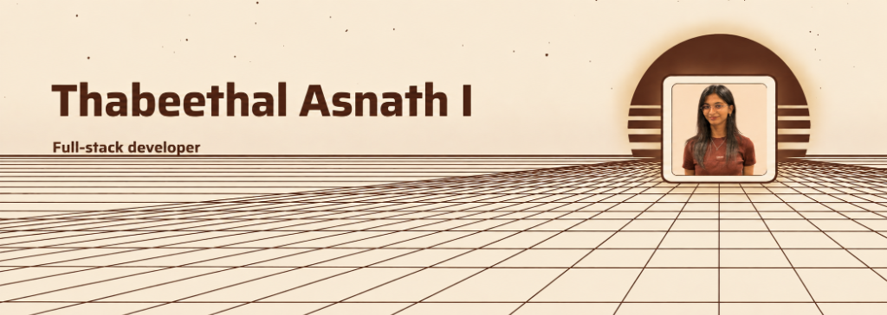

<h1 align="center">Hey there, I'm Thabeethal</h1>

  

---

<h3 align="center">👩‍💻 About Me</h3>

<table align="center">
<tr>
<td width="60%" valign="middle">

* 💻 Software Developer building real-world, end-to-end applications.
* ☕ Working with **Java, Spring Boot, REST APIs & MySQL**.
* ⚛️ Building modern interfaces with **React, JavaScript, HTML & CSS**.
* 🧩 Strong in **OOP, DBMS, Data Structures & API development**.
* 🚀 Exploring AI and building projects that solve real-world problems.
* ✨ Always learning, building, and improving.

</td>
<td width="40%" align="center" valign="middle">

</td>
</tr>
</table>

---

<h3 align="center">💻 Tech Stack & Tools</h3>

  

---

<h3 align="center">📈 GitHub Analytics</h3>

  

---

<h3 align="center">🐍 Contribution Graph</h3>

  

---

<h3 align="center">🌐 Let's Connect</h3>

  
  
  

See you in the next commit ☕

