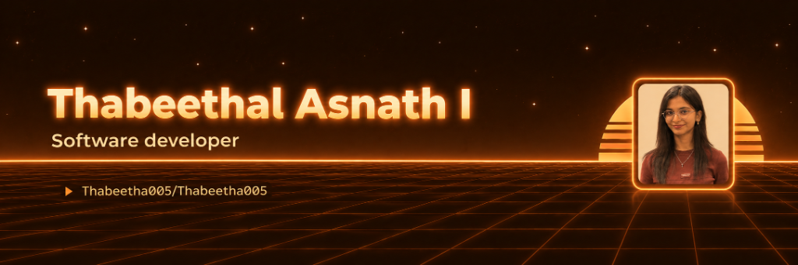
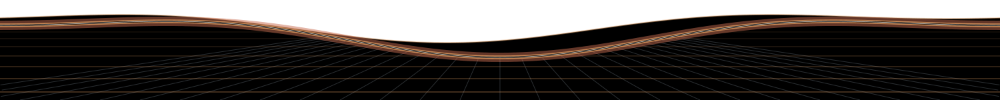

  
  
  

## 👩‍💻 About Me

<table>
<tr>
<td width="60%">

* 💻 Software Developer building real-world, end-to-end applications.
* ☕ Working with **Java, Spring Boot, REST APIs & MySQL**.
* ⚛️ Building modern interfaces with **React, JavaScript, HTML & CSS**.
* 🧩 Strong in **OOP, DBMS, Data Structures & API development**.
* 🚀 Exploring AI and building projects that solve real-world problems.
* ✨ Always learning, building, and improving.

</td>
<td width="40%" align="center">

</td>
</tr>
</table>

## 💻 Tech Stack

  

## 🚀 Featured Projects

### 💰 [Kalpanaaa Finance – Digital Wealth & Financial Advisory Platform](https://github.com/Thabeetha005/Finance_Management_System)
> **Stack:** `Java 21` • `Spring Boot 3.2.5` • `React 18` • `Tailwind CSS 3.4` • `MySQL 8.0` • `Docker` • `Railway`
- Full-stack digital wealth platform featuring investment portfolio management, automated loan calculators, and financial advisory services.
- Multi-tier role authorization, RESTful Spring Boot architecture, and containerized deployment with Docker and Railway.

### 🎫 [Order-Aware E-Commerce Helpdesk & Support Ticket System](https://github.com/Thabeetha005/Helpdesk-Support-Ticket-API)
> **Stack:** `Java` • `Spring Boot` • `React` • `MySQL 8+` • `JWT` • `REST APIs`
- Enterprise-grade support ticket system integrated with customer order histories (`ORD-XXXXX`).
- Strict server-side ownership security (validating customer principals against JWT), live SLA status tracking, dynamic priority escalations, and real-time ticket threading.

### 🎓 [Aura – Student Management System](https://github.com/Thabeetha005/student-management-system)
> **Stack:** `MongoDB` • `Express.js` • `React + Vite` • `Node.js` • `Glassmorphic CSS` • `Docker`
- MERN stack student management portal decorated with a bespoke dark-mode glassmorphic design system.
- Attendance enforcement using MongoDB compound indexes, role-based access control (`Admin`, `Teacher`, `Student`), and interactive Swagger/OpenAPI documentation.

### 🎟️ [Event Management REST API](https://github.com/Thabeetha005/event-management)
> **Stack:** `Node.js` • `Express` • `MongoDB` • `JWT` • `Swagger` • `Docker Compose` • `Render`
- Production-ready event lifecycle, attendee registration, and ticketing backend.
- Race-condition-safe atomic seat decrements, ticket code generation, venue check-in verification workflows, and Dockerized deployment.

## 📈 GitHub Analytics

  

  
  

  

## 🐍 Contribution Graph

  

## 🌐 Let's Connect

  
  
  

See you in the next commit ☕

